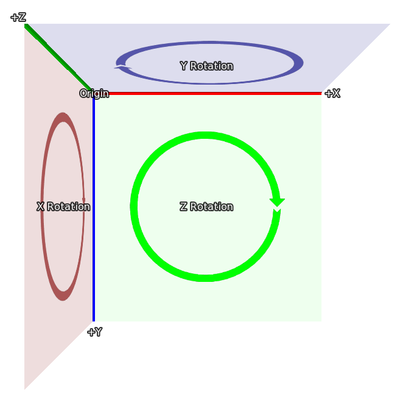

.. _3dstage:

3D舞台
========

3D舞台，正如其名称所指，是一个在三维空间中放置可视组件的概念。
Ren'Py在3D舞台中渲染可视组件时将计算合适的透视效果，并启用Z轴维度、灯光和深度效果。

.. _coordinates:

坐标系
-----------

要理解3D舞台的话，可能最重要的点是Ren'Py使用的3D坐标系。
这是在2D坐标系中放置可视组件的方式：

在2D坐标系中，整个矩形就是界面的尺寸。可见区域的宽和高通过 :func:`gui.init` 项进行配置(通常在新建游戏项目时配置)。

.. image:: axes_3d_2.png

3D舞台从原有的坐标系中扩展出了一个新轴——Z轴，其方向正对观察者视线。
图像坐标在Z轴方向的值大于0时，该物体距离观察者近(图像比原尺寸大)；
图像坐标在Z轴方向的值小于0时，该物体距离观察者远(图像比原尺寸小)。

最后，当图像在3D坐标系中旋转时，各个轴的变化情况如下：

* 绕Z轴旋转，X和Y轴数值变动。
* 绕X轴旋转，Y和Z轴数值变动。
* 绕Y轴旋转，Z和X轴数值变动。

这些坐标系的要点解释，是为了使Ren'Py开发者更容易从2D舞台转入3D舞台。
当导入3D模型后，还需要根据模型坐标进行坐标变换，使模型能正确显示。

.. _camera:

摄像机
------

摄像机的初始位置由参数 :func:`gui.init` 控制。
Ren'Py会根据 `width` 和 `fov` 计算出默认的 `z` 轴坐标。在 `fov` 默认值为75的情况下：

* 当 width = 1280，z轴坐标大约为834
* 当 width = 1920，z轴坐标大约为1251
* 当 width = 3840，z轴坐标大约为2502

实际的z轴坐标与这里给的数值有一个小于1的误差。
默认的z轴坐标可以通过样式特性 :tpref:`perspective` 或配置项 :var:`config.perspective` 进行修改。

Ren'Py会自动给摄像机坐标设置一个坐标偏移量(`width` / 2, `height` / 2, `z`)。
摄像机观看方向为Z轴的负无穷方向。

这个初始的 `z` 轴距离也是摄像机到某个特殊平面的距离。
在此特殊平面上的图像，正好能显示原来的尺寸(忽略整个应用窗口的缩放效果)。
增大摄像机的z轴坐标可以让所有显示内容变小，相反则会让显示内容变大。

最后一点， :tpref:`perspective` 和 :var:`config.perspective` 设置了摄像机可视范围，默认的最近和最远距离分别是100和10000.
当图像与摄像机的z轴距离小于100或大于10000时，图像将不会显示。

.. _using-the-3d-stage:

使用3D舞台
------------------

使用3D舞台时，首先需要使用 ``camera`` 语句指定图层。常用方法是：

::

    camera:
        perspective True

创作者可能还会想要设置一个默认的摄像机位置。详见下面的内容。

显示图像(背景和sprite)则与2D坐标系中相同：

::

    scene bg washington

    show lucy mad at right

    show eileen happy

所有可视组件都可以在3D空间内移动：

::

    scene bg washington:
        xalign 0.5 yalign 1.0 zpos -1000

    show lucy mad:
        xalign 1.0 yalign 1.0 zpos 100

    show eileen happy:
        xalign 0.5 yalign 1.0 zpos 200

指定一个ATL变换后，不再使用默认的变换，因此有必要显式声明 :tpref:`xalign` 和 :tpref:`yalign` 的值，分别对应可视组件在x和y轴的坐标。
当然，变换也可以像下面这样使用：

::

    transform zbg:
        zpos -100

    transform z100:
        zpos 100

    transform z200:
        zpos 200

    scene bg washington at center, zbg

    show lucy mad at right, z100

    show eileen happy at center, z200

如果尝试过3D舞台，你会发现背景图片周围有一些空白空间。
这是因为背景向后移动后，显示的尺寸变小了，不能填充整个屏幕。
Ren'Py提供了一个简单方式修复这个问题—— :tpref:`zzoom` 。
将 :tpref:`zzoom` 特性设置为True后，无论图像在z轴负方向的值是多少，都会放大图像填充整个屏幕。
这对背景图像很有效：

::

    transform zbg:
        zpos -100 zzoom False

使用ATL也可以调整zpos的值，如同调整xpos和ypos一样：

::

    show eileen happy at center:
        zpos 0
        linear 4.0 zpos 200

需要注意，zpos与几个特殊位置(比如 ``left`` 和 ``right`` )以及位置相关特性(比如 :propref:`xalign` 和 :propref:`yalign` )一起使用时，
可能出导致奇怪的问题。因为Ren'Py会将图像放在一个三维的有体积的矩形中(就像一个方块，但各边长度不一致)，并对图像应用透视效果，
最终导致部分图像移出屏幕范围。

摄像机也可以移动，使用 ``camera`` 语句。例如：

::

    camera:
        perspective True
        xpos 0
        linear 3.0 xpos 500

需要移动摄像机时，最好使用比整个窗口还要大的背景图片。

如果在某个sprite上应用了zpos值但没有任何效果，原因可能是在 ``camera`` 语句后面忘记添加 ``perspective`` 从句了。

摄像机可以转动，比如：

::

    camera:
        perspective True
        rotate 45

注意摄像机转动后的效果，与可视组件旋转相反方向类似。

.. _depth:

深度
-----

默认情况下，Ren'Py根据声明顺序显示图像，最后声明的图像覆盖在其他所有图像之上。
这个机制会导致一些小问题，比如距离摄像机更近的图像(使用透视效果)被远处的图像遮挡住。

如果不想要在游戏中的图像显示层级出现类似问题，可以让GPU根据深度 :tpref:`gl_depth` 排列图像顺序，使用：

::

    camera:
        perspective True
        gl_depth True

名义上处于相同深度的图像可能会相互覆盖和显示错误。将这些图像压制(flatten)为单一图像并同时显示就能解决该问题。

.. _matrix-transforms:

矩阵变化
-----------------

Ren'Py中可以使用 :tpref:`matrixtransform` 变化特性，将某个矩阵应用到可视组件上，实现三维空间中图像的伸缩、位移和旋转。
:tpref:`matrixtransform` 特性可以使用一个 :func:`Matrix` 实例或transformmatrix(定义在下一节)，并应用到显示图像的4个角的顶点上。

Ren'Py使用 :tpref:`matrixanchor` 变换特性使矩阵应用更方便。
:tpref:`matrixanchor` 的默认值是(0.5, 0.5)，并使用通用Ren'Py锚点规则转换为图像内部的像素偏移值。
(如果是正数，视为像素数；否则视为整个像素尺寸的比例值。)

Ren'Py将矩阵变换应用到图像上时，首先将图像锚点设置(0, 0, 0)。应用矩阵变换后，再将锚点回复为原值。
默认情况下，变换矩阵会应用到图像中心位置。

例如：

::

    show eileen happy at center:
        matrixtransform RotateMatrix(45, 0, 0)

会将图像沿着其水平中轴做旋转。图像顶部向z轴负方向移动，图像底部向z轴正方向移动。

多个矩阵可以使用乘法连接，依次从右到左实现变换效果。
例如：

::

    show eileen happy at center:
        matrixtransform RotateMatrix(45, 0, 0) * OffsetMatrix(0, -300, 0)

图像将向上平移300像素，然后沿X轴旋转45度。

.. _3dstage-structural-similarity:

结构相似原则
^^^^^^^^^^^^^^^^

在ATL中，对 :tpref:`matrixtransform` 特性进行插值，要求使用的TransformMatrix对象具有相似结构。
这表示相同类型的TransformMatrix，使用相同顺序相乘。

下面的样例中，会对图像进行旋转和平移，然后再转回去：

::

    show eileen happy at center:
        matrixtransform RotateMatrix(0, 0, 0) * OffsetMatrix(0, 0, 0)
        linear 2.0 matrixtransform RotateMatrix(45, 0, 0) * OffsetMatrix(0, -300, 0)
        linear 2.0 matrixtransform RotateMatrix(0, 0, 0) * OffsetMatrix(0, 0, 0)

对matrixtransform的第一步设置看起来似乎是多余的，但实际并非如此，这步确定了后续插值使用的矩阵结构。
如果不在第一步设置矩阵结构，后面的插值都将略过。

.. _transformmatrix:

TransformMatrix
---------------

Matrix对象只适合静态变换，对动画变换没什么用。
还有一种可以将普通矩阵参数化的方法。

TransformMatrix是由同一个基类扩展得到的一些使用矩阵创建的类。
Ren'Py调用TransformMatrix类的实例，并得到返回矩阵结果。
TransformMatrix已很好集成在ATL中，可以使用matrixtransform实现动画。

::

    transform xrotate:
        matrixtransform RotateMatrix(0.0, 0.0, 0.0)
        linear 4.0 matrixtransform RotateMatrix(360.0, 0.0, 0.0)
        repeat

TransformMatrix的子类必须要实现 ``__call__`` 方法。该方法需要两个参数：

* 插值计算用的旧对象。这个对象可以是任意类，如果不存在旧对象则为None。
* 介于0.0到1.0之间的一个数值，表示插值比例。0.0对应旧对象的值，1.0表示完全使用新对象的值。

.. _build-in-transformmatrix-subclasses:

内建的TransformMatrix子类
-------------------------

下面的列表是Ren'Py内建的TransformMaxtrix子类：

.. function:: OffsetMatrix(x, y, z)

    TransformMatrix子类，将顶点移动固定数值后，返回一个矩阵。

.. function:: RotateMatrix(x, y, z)

    TransformMatrix子类，将可视组件绕原点旋转后，返回一个矩阵。

    `x, y, x`
        绕远点旋转的数量，单位是度。

    旋转按如下顺序实行：

    * 在Y/Z平面顺时针旋转x度。
    * 在Z/X平面顺时针旋转y度。
    * 在X/Y平面顺时针旋转z度。

.. function:: ScaleMatrix(x, y, z)

    TransformMatrix子类，缩放可视组件后，返回一个矩阵。

    `x, y, x`
        各轴缩放系数。

.. _3d-transform-properties:

变换特性
--------------------

下列变换特性可以在3D舞台中使用。

    :tpref:`perspective`， :tpref:`matrixanchor`， :tpref:`matrixtransform`， :tpref:`zpos`， :tpref:`zzoom`

.. transform-property:: matrixanchor

    :type: (position, position)
    :default: (0.5, 0.5)

    该特性指定图像关联的锚点位置矩阵。
    如果变量是浮点数，是与子组件尺寸相关的比例值；否则，表示像素数。

    该特性会将matrixtransform应用的变换对象的值设置为原点(0, 0, 0)的位置。

.. transform-property:: matrixtransform

    :type: None or Matrix or TransformMatrix
    :default: None

    若非空，该特性指定的矩阵用于变换子组件的顶点变换。
    该变换对象用作子组件变换位置与屏幕坐标间的转换。

    对该特性进行插值计算时，必须使用TransformMatrix对象，并且这些对象具有相似结构。

.. transform-property:: perspective

    :type: True or False or Float or (Float, Float, Float)
    :default: None

    该特性应用到某个变换时，启用透视渲染效果。    
    特性值应该是个3元元组，分别表示最近平面、1:1平面z轴距离和最远平面。

    如果值是一个浮点数，最近和最远平面从配置项 :var:`config.perspective` 获取。
    如果值是True，所有3个数值都从配置项 :var:`config.perspective` 获取。

    当perspective特性不是False时， :tpref:`xpos` 、 :tpref:`ypos` 、 :tpref:`zpos` 和 :tpref:`rotate` 的值是反转的，
    表示相对摄像机的位置，而不是某个子组件自身的坐标。

    由于透视变换假设结果是与窗口对其的，所以不要用 :tpref:`xanchor`、 :tpref:`yanchor`、:tpref:`anchor`、:tpref:`align`、:tpref:`center`。

.. transform-property:: zpos

    :type: float
    :default: 0

    改特性表示子组件在z轴方向的偏移。
    当perspective特性值是False时，可以直接使用该特性值，否则需要乘以-1后再使用。

    如果设置该特性后子组件消失，可能的原因是作为父组件的可视组件本身的zpos是False。

.. transform-property:: zzoom

    :type: bool
    :default: False

    若该特性值为True，1:1平面(`zone`)的z轴距离将于该可视组件的zpos值保持一致。
    子组件则根据 (`zone` - `zpos`) / `zone` 在x和y轴缩放。

    改特性用作背景的可视组件，在 `zpos` 为负值的情况下，不会出现显示过小无法覆盖整个屏幕的情况。
    该项设置为True后，背景图像始终将以1:1的比例显示。
